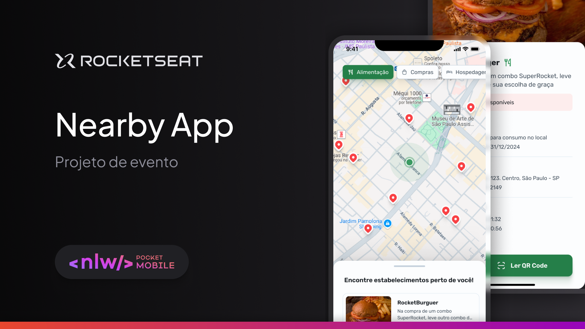
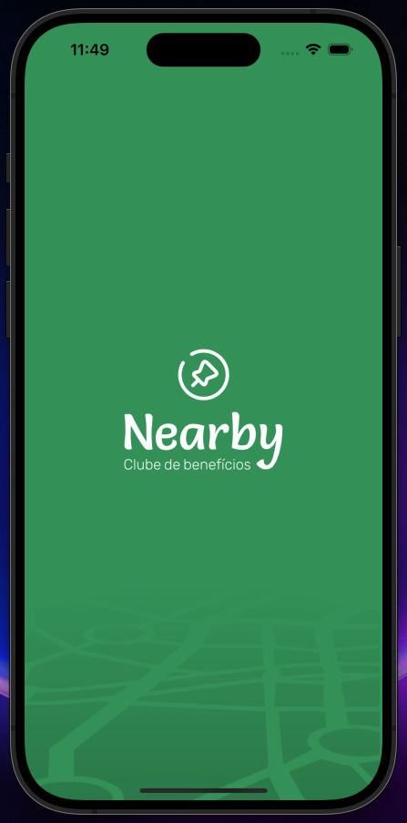
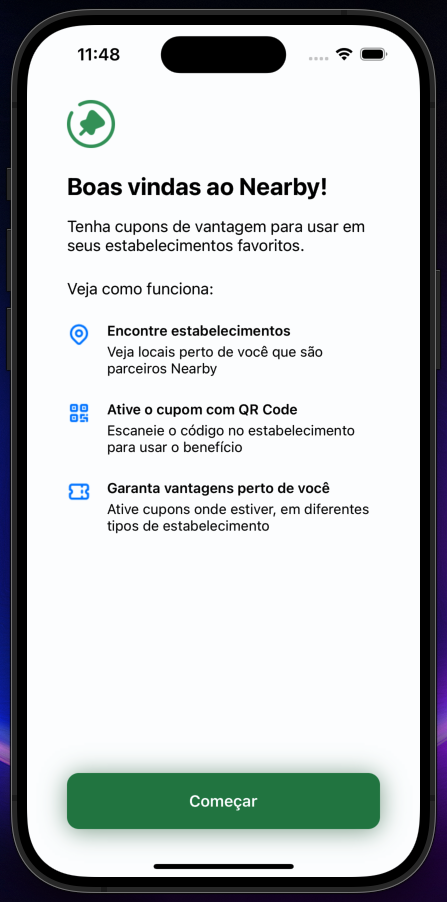
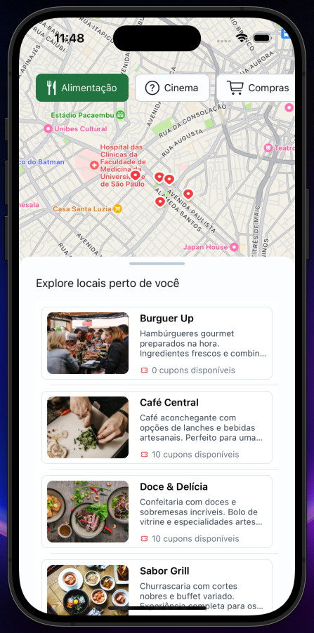
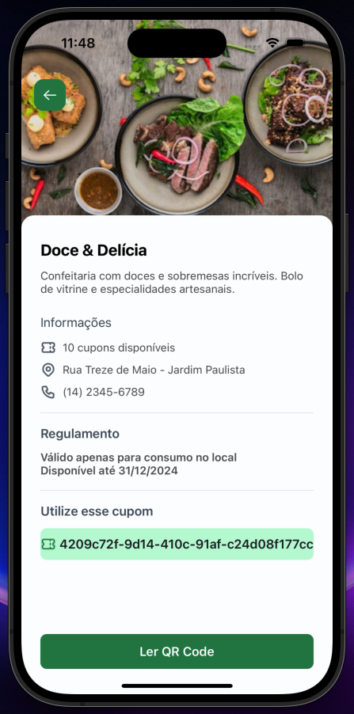

# Nearby

Project developed on Rocketseat's NLW Pocket: Mobile - Swift

**Nearby is an app for searching for discount coupons from establishments near the user, based on their current location.**

## 📋 Project information

- NLW Pocket: Mobile - Swift

## 🧠 Concepts learned

The development of this project aims to learn the following concepts:

- Applying of ViewCode concepts
- MVVM-C architecture
- Closures
- FlowDelegate
- Functions in Objective-C
- Integrate with an API
- TableView
- MapView

## Views

| Splash screen | Welcome | Home | Place Details |
| ----- | ----- | ----- | ----- |
|  |  |  |  |

## 🔗 Project Links

- 🎨 [**Figma**](https://www.figma.com/community/file/1448070647757721748)

## 💻 Technologies

- Swift
- UIKit

## 📄 License

This project is licensed under the MIT License - see the [LICENSE](./LICENSE) file for more details.
